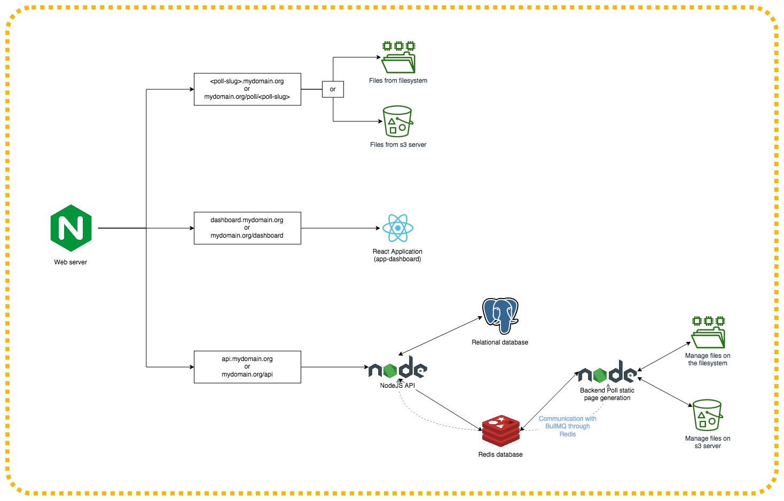

<div style="text-align: center">
    <h1>Formol</h1>
    <a href="https://github.com/SN-DAI18-20/Formol/actions"></a> <a href="https://lgtm.com/projects/g/SN-DAI18-20/Formol/alerts/"></a> <a href="https://lgtm.com/projects/g/SN-DAI18-20/Formol/context:javascript"></a>
</div>

**Formol** is a poll system generator built in NodeJS.

**Note:** this project is as scholar project. Is not intended to be a usable
solution in production environments.

## Goal
The goal of this project is to:
 * Add the possibility to create/update/delete polls
 * Add the possibility to get stats about created polls
 * Host or give the possibility to the user to host itself his poll
 * Add the possibility to customize a poll

## Tech choices
We choosen for this project to create a mono-repository.

The backend is built arround:
 * NodeJS
 * [Fastify](https://www.fastify.io/) _as Web micro-framework_
 * [SequelizeJS](https://sequelize.org/v5/) _as Database ORM_
 * [PostgreSQL](https://www.postgresql.org/) _as relational database_
 * [Bull](https://github.com/OptimalBits/bull) _as Task/Message queuing_
 * [Redis](https://redis.io/) _as Task/Message queuing broker (and if needed as cache)_
 * [OpenAPI](https://github.com/fastify/fastify-swagger) _for documenting the REST API._

The frontend is built arround [NextJS](https://nextjs.org/) framework and uses the [MaterialUI](https://material-ui.com/) components library.

Note: _For now, authentication mechanisms are **not planned** for the dashboard. Of course, the technical stack can add new elements on the future of the project._

## Architecture diagram


## Installing
For deploying the whole stack in one click, you need to install Docker on your machine.

 * If you have a Windows 10 Family edition, download [Docker Toolbox](https://github.com/docker/toolbox/releases)
 * If you have a Windows 10 Pro/Entreprise edition, download [Docker Desktop edition](https://hub.docker.com/editions/community/docker-ce-desktop-windows)
 * If you have a Mac, download [Docker Desktop for Mac](https://hub.docker.com/editions/community/docker-ce-desktop-mac)
 * If you are running a Linux distribution, you can follow [this guide](https://docs.docker.com/install/). If your distribution is not in the guide, you can install the package with your package manager.

Also, you will need Docker compose. It should be included if you have installed Docker on your Windows or Mac machine. If it's not, you can follow [this guide](https://docs.docker.com/compose/install/) to install it.

To see if Docker is running on your machine, you can open a terminal an type `docker ps` command. If the command returns you a message similar of this: `Cannot connect to the Docker daemon at unix:///var/run/docker.sock. Is the docker daemon running?`, you need to boot Docker:
 * On windows: just click on a Docker shortcut in your Start menu.
 * On Mac: open spotlight and type "Docker".
 * On Linux: Type in your terminal `sudo systemctl start docker`. If the command `docker ps` returns you the same message, add your user to the Docker group with `sudo usermod -aG docker <your_username>` and reboot your machine.

Just before booting the stack, create a copy of each config files in the `config` folder of each projects and remove the `.example` in the name (**but also ensure you still have the original file with `.example` extension.**) and update the configuration if needed.

**Note:** the default configuration fit with the Docker environment. You need to change some parts with external credentials like email or the s3 server.
**Note2:** the wildcard certificate provided was generated by Let's Encrypt DNS-01 challenge. If for whatever reason, you want to renew the certificate before the expiration of the domain (_2021-02-27T23:59:59.0Z_), please open an issue.

Now, if you open a terminal in the root folder of the repository, you can now start the stack by using the command:
```
docker-compose start
```

The first boot will pull and build all docker images and start all components.

If you want to stop the stack, you can use the command:
```
docker-compose stop
```

or if you want to kill, remove all containers of your machine and remove created networks if you want to save space, if you will no more contribute to the project or simply if you want to start from scratch the whole stack, you can use the command:
```
docker-compose down
```

If you want to start a specific service, you can use the command:
```
docker-compose up (-d) <service_name>  # -d argument if you want to detach the container and have you terminal free
```

Or stop it with the command:
```
docker-compose stop <service_name>
```

Starting a service will start automatically his required components like the web server, the database or an another service.

Also please refer to the [Docker compose documentation](https://docs.docker.com/compose/) if you need more informations about how work the `docker-compose` CLI and how to modify the `docker-compose.yml` file.

## Access to services
A domain name was created for the project. the entry `dev.formol.site` and `*.dev.formol.site` redirects to `127.0.0.1` and `::1`.

If boot the stack locally in your machine you can use `dev.formol.site:<service_port>` to access to the service you want to use.

If you use Docker, the reverse proxy is configured to serve services on specific subdomains:
 * API: `api.dev.formol.site`
 * Dashboard: `dashboard.dev.formol.site`
 * S3 (minio): `s3.dev.formol.site`

## Contributions guide
Before contributing to the project, please read the [contribution guidelines](CONTRIBUTION.md).
